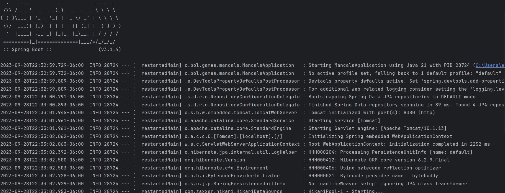
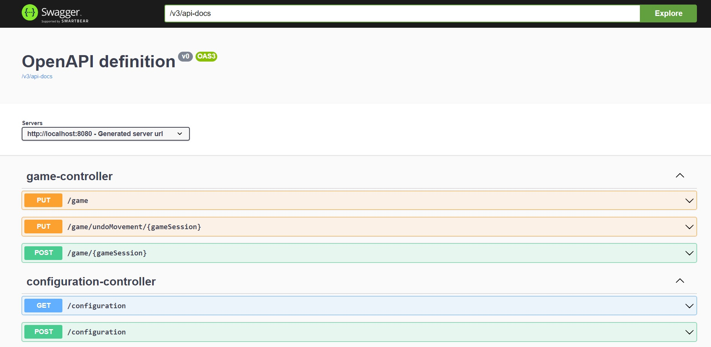
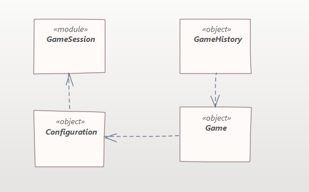
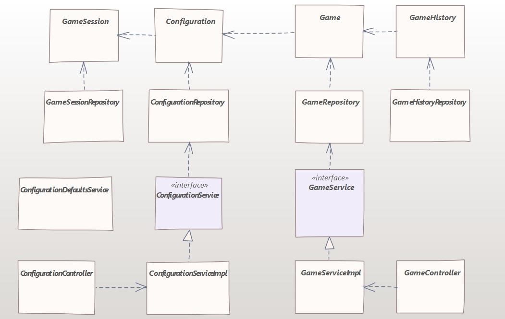

# mancala-backend
Backend API for Mancala UI, built with Java 21 (Spring boot 3.1.4) exposes a REST API to be used by [mancala-ui](https://github.com/erickturcios/mancala-ui) project
This API is designed to handle games per browser user session, which means:
- Each user will have his/her own game configuration if the browser session is not closed
- Each game movement is saved to MySQL database, which allows "Undo movement" whenever the user requires it
- Each user can customize a custom configuration (not shared to any other user), e.g. initial number of stones, auto rotate on each turn, allow "undo last movement"

This application was developed based on the following basic rules:

## Game Setup
The player who begins with the first move picks up all the stones in any of his own six pits, and sows the stones on to the right, one in each of the following pits, including his own big pit. No stones are put in the opponents' big pit. If the player's last stone lands in his own big pit, he gets another turn. This can be repeated several times before it's the other player's turn.

## Capturing Stones
During the game the pits are emptied on both sides. Always when the last stone lands in an own empty pit, the player captures his own stone and all stones in the opposite pit (the other player’s pit) and puts them in his own (big or little?) pit.

## The Game Ends
The game is over as soon as one of the sides runs out of stones. The player who still has stones in his pits keeps them and puts them in his big pit. The winner of the game is the player who has the most stones in his big pit.

# Database Requirements
This application requires a database connection. This configuration can be set in 
 - Application properties: [src/main/resources/application.properties](src/main/resources/application.properties)

 - Test runtime properties: [src/test/resources/application.properties](src/test/resources/application.properties)


## Default database
**H2** is set as default database, aimed to easy the initial application start, which includes this default configuration:

```    
    spring.datasource.url=jdbc:h2:mem:testdb
    spring.datasource.username=sa
    spring.datasource.password=password
    spring.jpa.database-platform=org.hibernate.dialect.H2Dialect
    spring.sql.init.platform=h2
```

## MySQL Configuration
Database can be set to MySQL with this configuration:

``` 
    # MySQL sample configuration
    spring.datasource.url=jdbc:mysql://localhost:3306/{databaseName}
    spring.datasource.username={userName}
    spring.datasource.password={mysqlPswd}
    spring.datasource.driver-class-name=com.mysql.cj.jdbc.Driver
``` 

Replacing:
 - {databaseName} with MySQL database name
 - {userName} and {mysqlPswd} with respective database credentials (username and password)

## Schema definition
Tables structure is defined for H2 and MySQL database in these files:
 - src\main\resources\schema-h2.sql
 - src\main\resources\schema-mysql.sql

 By default the application will execute these files, du to this configuration in application.properties:

  - spring.jpa.hibernate.ddl-auto=create-drop

 if you want to prevent this behavior you may change this parameter to "none":

  - spring.jpa.hibernate.ddl-auto=none

  Be careful when switching from in-memory to a ‘real’ database that you do not make assumptions about the existence of the tables and data in the new platform

# Run the application 
Run it with this command:

    .\mvnw spring-boot:run




Then you can access:

## Open API UI (Swagger)

    http://localhost:8080/swagger-ui/index.html#/



## Open API Doc (for postman)

    http://localhost:8080/v3/api-docs

## Application basic model

This is a high level view of objects used in the application:



## Application extended model

This is a more complete detail of the application design:




# Run Tests

## Unit Tests

    mvn test -Dgroups=UnitTest   

## Integration Tests

    mvn test -Dgroups=IntegrationTest
